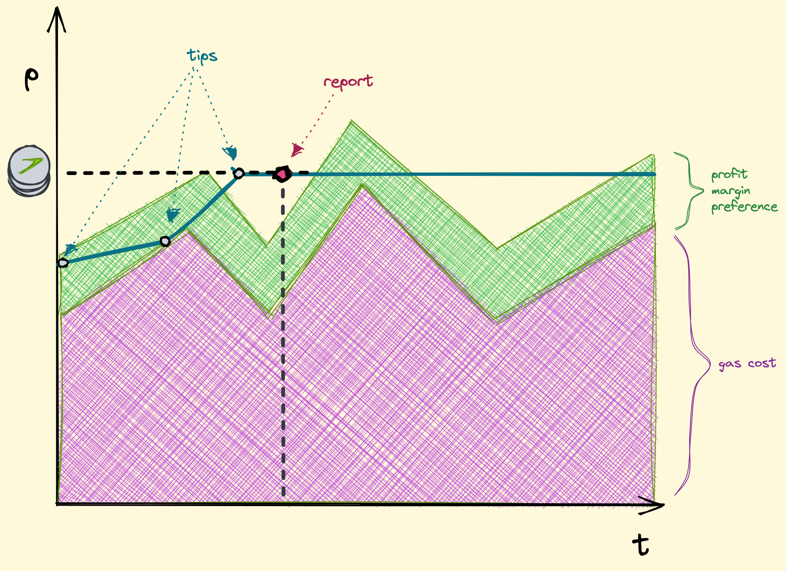

# Auto Tipper Bot

This is a bot for automatically tipping a query id at a fixed interval. It can tip a query id on Ethereum mainnet, Polygon, Goerli, or Mumbai at a fixed interval, wait for a data report, and increase the tip a max number of times until a report is submitted.

### Clone repo and cd
```sh
git clone https://github.com/tellor-io/auto-tipper-bot.git
```
```sh
cd auto-tipper-bot
```
```sh
mv .env.example .env
```

### Setup

```sh
python3 -m venv venv
```
```sh
source venv/bin/activate
```

```sh
pip install -e .
```

### Usage
Add your private key and rpc url to `.env` file. Update the `QUERY_ID`, `QUERY_DATA`, and `INTERVAL` to your desired values.

**To begin tipping**
```sh
tipper
```

### How It Works
The bot will automatically determine a tip amount as a function of the current gas cost, oracle token price (TRB), and base token price (ETH, MATIC). It calculates the cost of paying for gas in terms of the oracle token and adds a buffer of $2. It then waits 45 seconds for a data report. If a report is submitted, the bot then waits for the next tipping interval. If no report was submitted, the bot recalculates the gas cost in terms of the oracle token, adds the $2 buffer, and multiplies this value by 1.10. It keeps doing this until a report is submitted or up to a max of 10 times.

<!--  -->
<p align="center">
  
</p>

### Why Use This
The Tellor oracle works by incentivizing data reporters to submit your requested data. Reporters have to cover gas costs plus earn some profit. This bot is a handy tool for anyone who wants to make sure their data is reported at a fixed interval while accounting for varying gas costs. When gas costs are low, the bot will tip a lower amount. When gas costs are high, the bot will tip a higher amount.

### To Do
- [x] update contract addresses to latest
- [ ] check base token and tipping token balances
- [ ] create generalized contract function caller
- [ ] retrieve token prices from multiple sources, handle errors, and medianize
- [ ] add logging to file with garbage collection
- [ ] allow multiple simultaneous queryId's with different tipping intervals
- [ ] dynamic query types, ie. TellorRNG(timestamp) with different timestamp each time -> different queryId
- [ ] comment code, documentation, and tests
- [ ] notifications (text/email/discord/telegram) configurable by user (tips, reports, low balance, etc.)

## Maintainers <a name="maintainers"> </a>
This repository is maintained by the [Tellor team](https://github.com/orgs/tellor-io/people)


## How to Contribute<a name="how2contribute"> </a>  

Check out our issues log here on Github or feel free to reach out anytime [info@tellor.io](mailto:info@tellor.io)

## Copyright

Tellor Inc. 2023